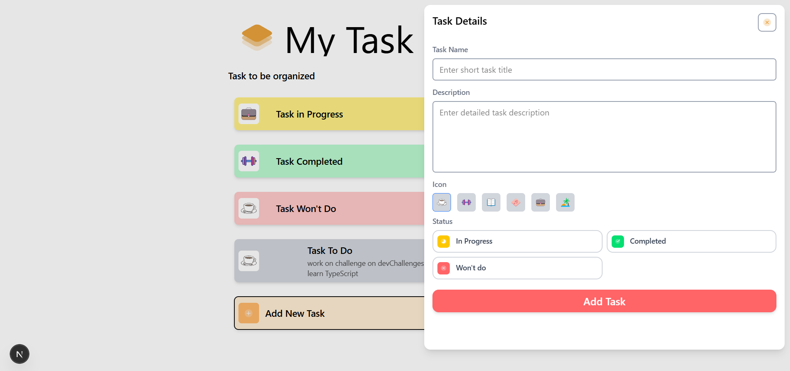

<h1 align="center">My Task Board | devChallenges</h1>

   Solution for a challenge <a href="https://devchallenges.io/challenge/my-task-board-app" target="_blank">My Task Board</a> from <a href="http://devchallenges.io" target="_blank">devChallenges.io</a>.

  <h3>
    <a href="https://your-demo-link.vercel.app">
      Demo
    </a>
     | 
    <a href="https://github.com/your-username/my-task-board">
      Solution
    </a>
     | 
    <a href="https://devchallenges.io/challenge/my-task-board-app">
      Challenge
    </a>
  </h3>

---

## Table of Contents

- [Overview](#overview)
  - [What I learned](#what-i-learned)
  - [Useful resources](#useful-resources)
- [Built with](#built-with)
- [Features](#features)
- [Contact](#contact)
- [Acknowledgements](#acknowledgements)

---

## Overview

This project is a simple task board where users can:

- Create boards

- Add tasks

- Organize tasks by status (e.g., Todo, Doing, Done, Failed)

- Delete tasks and boards

It was built as part of the My Task Board challenge from devChallenges.io. The app provides a clean and minimal UI for managing personal tasks.

### What I learned

- CRUD API routes using Next.js App Router
- Zustand for global state management
- MongoDB with Mongoose integration
- Async operations with optimistic UI patterns
- Good practices with folder structure and reusable components

### Useful resources

- [Zustand Docs](https://docs.pmnd.rs/zustand/getting-started/introduction) - For easy global state
- [Next.js App Router](https://nextjs.org/docs/app) - New routing structure
- [MongoDB with Mongoose in Next.js](https://mongoosejs.com/) - Data modeling and connection handling
- [Tailwind CSS](https://tailwindcss.com/docs) - Fast and modern UI utility classes

---

## Built with

- Semantic HTML5 markup
- Tailwind CSS
- React (with App Router in Next.js 13+)
- TypeScript
- Zustand
- MongoDB + Mongoose
- Vercel (deployment)

---

## Features

- ✅ Create/Delete Boards
- ✅ Add/Delete Tasks
- ✅ Realtime UI updates
- ✅ Responsive layout

---

## Contact

- GitHub: [@your-username](https://github.com/your-username)
- Website/Portfolio: [your-website.com](https://your-website.com)
- LinkedIn: [linkedin.com/in/your-profile](https://linkedin.com/in/your-profile)

---

## Acknowledgements

- Inspired by [devchallenges.io](https://devchallenges.io)
- Thanks to the open-source community for Zustand, Tailwind, and Next.js
